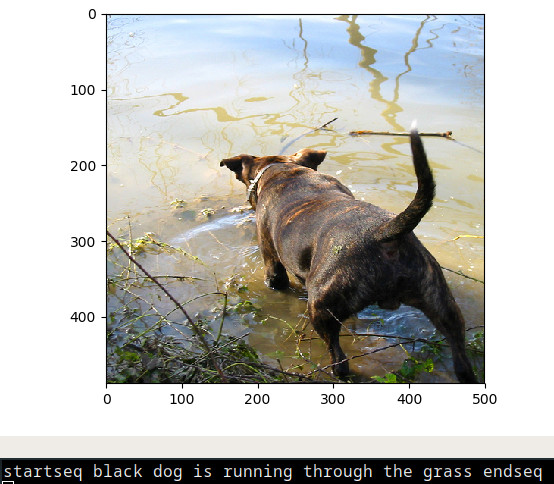

# Image Captioning with PyTorch

A simple encoder-decoder model which captions images. Inspired by this wonderful [repo.](https://github.com/yunjey/pytorch-tutorial/tree/master/tutorials/03-advanced/image_captioning)

## Screenshot examples



## Dataset

I have used the [Flickr8k Dataset](https://forms.illinois.edu/sec/1713398). It contains about 8,000 images as well as text files specifying the train, test and dev images.

## Usage

1. Download the Flickr8k Dataset into the same directory and extract the dataset to a file named `Flickr8k_Dataset`, extract the text files to a file named `Flickr8k_text`.

2. **Preprocessing the captions**  

    ```shell
    $ python preprocessing_descriptions.py
    ```

3. **Training the model**  

   ```shell
   $ python model_train.py
   ```

4. **Test the model**

   ```shell
   $ python test.py --image path/to/image
   ```